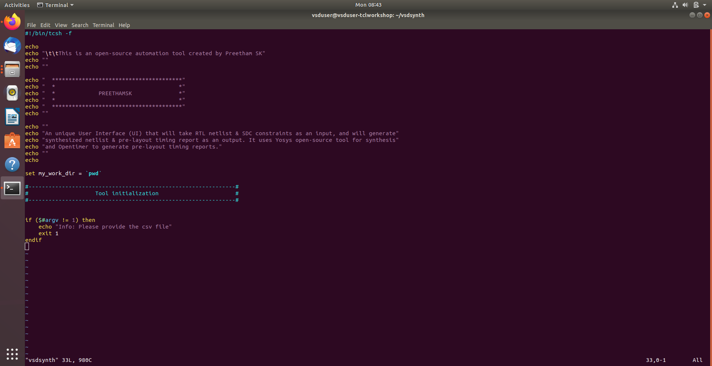
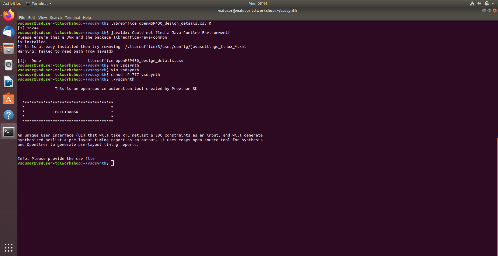
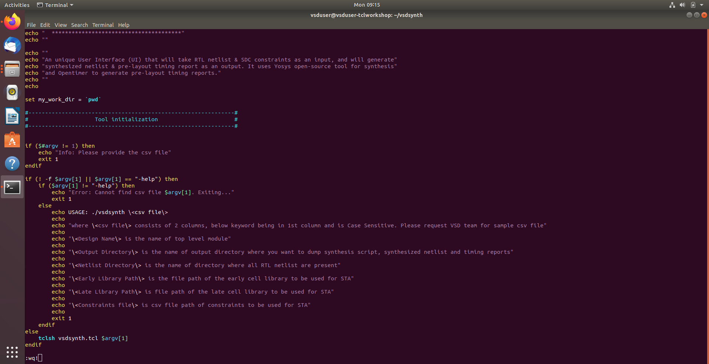
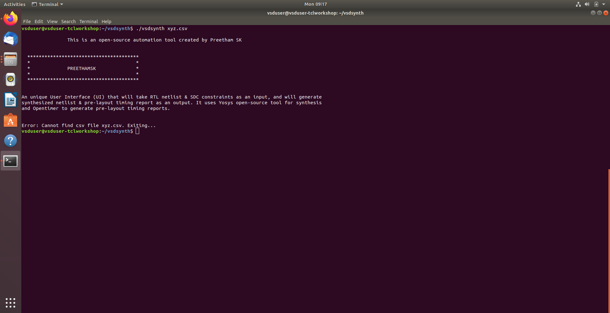
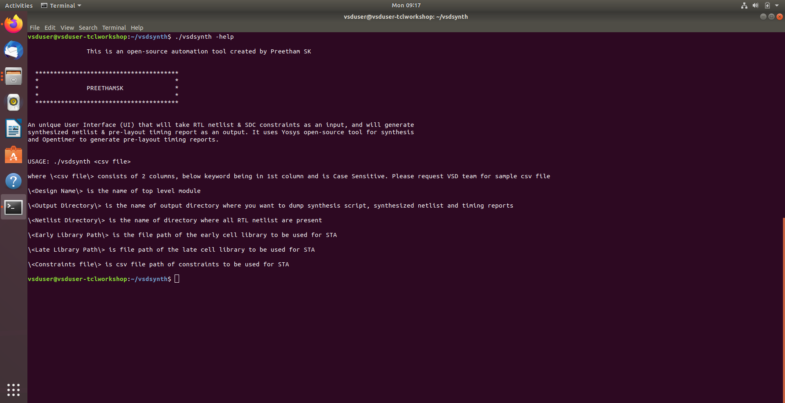

# Day 1 : Introduction to TCL and VSDSYNTH Toolbox Usage

## Day 1 Summary

- Established a strong foundation in TCL-based automation by building a design-agnostic configuration framework driven by external CSV inputs.
- Decoupled design parameters from TCL logic, enabling scalable reuse of the automation flow across multiple RTL designs.
- Developed a shell-based front end (`vsdsynth`) using `tcsh`, transforming the scripts into a structured command-line automation tool.
- Implemented professional CLI behavior with clear tool headers, controlled execution flow, and safe termination for invalid inputs.
- Added robust argument validation to ensure mandatory configuration files are provided before initiating synthesis.
- Enhanced tool reliability through advanced input validation, including physical file existence checks.
- Introduced a comprehensive `-help` subsystem to guide users on CSV formats, required keywords, and directory structure expectations.
- Integrated the shell pre-processing layer with the TCL synthesis engine (`tclsh`), allowing only validated data into the core flow.
- Applied defensive programming practices to distinguish and handle multiple user error scenarios clearly.
- Validated the Linux CAD environment to ensure readiness for automated VLSI design workflows.

## Task 1: Design Configuration & Environment Setup

- Implemented a CSV-driven configuration framework to enable design-agnostic TCL automation.
- Centralized design metadata in `openMSP430_design_details.csv` for scalable reuse across designs.
- Parsed key–value pairs to reliably initialize synthesis variables within TCL scripts.
- Automated directory mapping for RTL sources (`./verilog`) and output generation (`./outdir_openMSP430`).
- Integrated OSU 0.18µm standard cell libraries via explicit library search paths.
- Validated the Linux CAD environment for permissions, paths, and execution readiness.

**Screenshot:**

## Task 2: Shell Scripting & User Input Validation

- Developed a shell-based wrapper script (`vsdsynth`) using `tcsh` to control the end-to-end automation flow.
- Implemented a command-line interface header to clearly present tool functionality and integration with Yosys and OpenTimer.
- Added argument validation logic to verify the presence of the mandatory CSV configuration file before execution.
- Handled missing-input scenarios by displaying corrective usage instructions and safely terminating the flow.
- Applied executable permissions using environment-level commands to finalize the script as a Linux utility.

**Screenshot:**

## Task 3: Advanced Argument Parsing & Help Subsystem

- Enhanced tool robustness by adding advanced input validation and structured user support mechanisms.
- Implemented file existence checks to verify the validity of the provided CSV configuration before parsing.
- Developed a dynamic `-help` interface to guide users on required CSV keywords, formats, and directory expectations.
- Introduced granular error handling to clearly differentiate between missing inputs and invalid file paths.
- Integrated the shell-based pre-processing layer with the TCL synthesis engine (`tclsh`), ensuring only validated data enters the core flow.
- Enforced strict data specification rules, including keyword case sensitivity, to maintain configuration integrity.

**Screenshot:**

