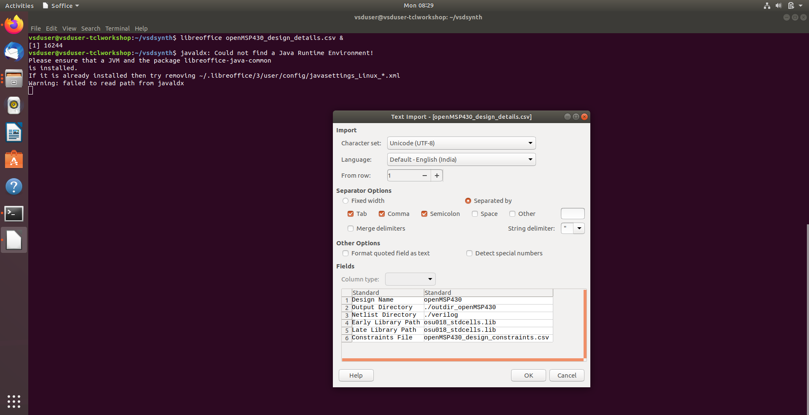
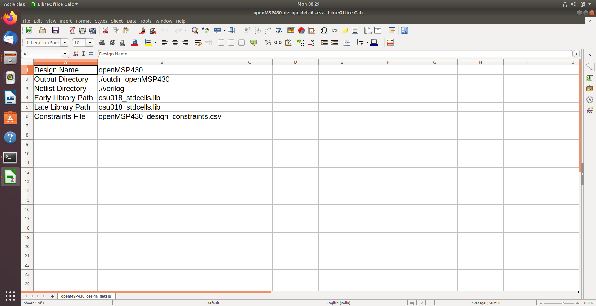

# Day 1 : Introduction to TCL and VSDSYNTH Toolbox Usage

## Task 1: Design Configuration & Environment Setup

- Implemented a CSV-driven configuration framework to enable design-agnostic TCL automation.
- Centralized design metadata in `openMSP430_design_details.csv` for scalable reuse across designs.
- Parsed key–value pairs to reliably initialize synthesis variables within TCL scripts.
- Automated directory mapping for RTL sources (`./verilog`) and output generation (`./outdir_openMSP430`).
- Integrated OSU 0.18µm standard cell libraries via explicit library search paths.
- Validated the Linux CAD environment for permissions, paths, and execution readiness.

**Screenshot:**

