# Day 2 : Variable Creation and Processing Constraints from CSV

## Day 2 Summary

- Built a **TCL-based CSV parsing engine** to dynamically convert configuration data into runtime variables, eliminating manual script edits between designs.
- Parsed multi-column design and constraint data into internal matrices, supporting efficient data access and manipulation.
- Implemented **automated environment validation** to ensure RTL directories, standard cell libraries, and output paths exist.
- Developed **intelligent directory management** to create missing folders automatically, maintaining a consistent workspace.
- Programmatically computed **matrix dimensions** and linked matrices to TCL arrays for accurate, scalable constraint processing.
- Introduced **boundary and header-to-data checks** to handle variable-length CSV inputs and distinguish metadata from functional data.
- Added **exception handling and environment reporting**, providing real-time feedback and status updates for each verified component.
- Validated the automation flow on the `openMSP430` design, ensuring proper integration of RTL netlists and timing constraints for synthesis readiness.

## Task 1: Variable Creation & CSV Data Processing

- Developed a **TCL-based CSV parsing engine** to automate variable assignment for design automation.
- Leveraged `struct::matrix` and `csv` packages to parse multi-column design data into a searchable internal format.
- Created an **automated loop** to read CSV keywords and assign them as global TCL variables for dynamic tool configuration.
- Implemented **absolute path mapping** using `file normalize` to prevent file access errors during synthesis.
- Built a **runtime debug dashboard** to display all initialized design variables for immediate verification.
- Validated the engine with the `openMSP430` design, ensuring RTL netlists and `.lib` timing models were correctly mapped.

**Screenshot:**

## Task 2: Environment Validation & Constraint Matrix Conversion

- Implemented **automated integrity validation** to ensure all standard cell libraries and RTL directories exist, preventing runtime failures.
- Developed **intelligent directory management** to automatically detect and create missing output directories for consistent workspace organization.
- Engineered a **secondary parsing engine** to load `openMSP430_design_constraints.csv` into a high-performance matrix for detailed timing data.
- Integrated **exception handling routines** to provide clear feedback if mandatory files or directories are unreachable.
- Enhanced the **environment reporting interface**, displaying status updates for every verified design component to provide full initialization visibility.

**Screenshot:**
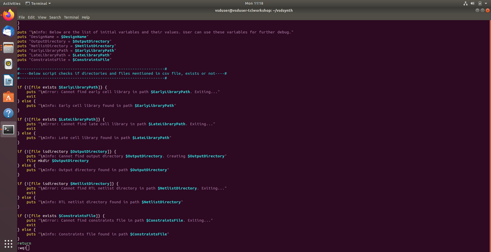
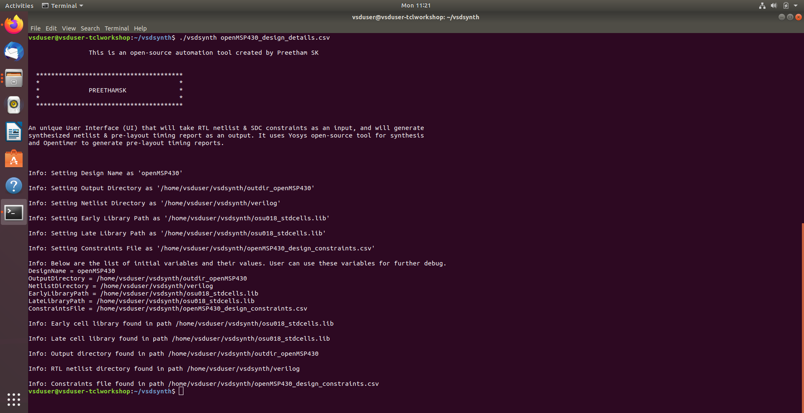
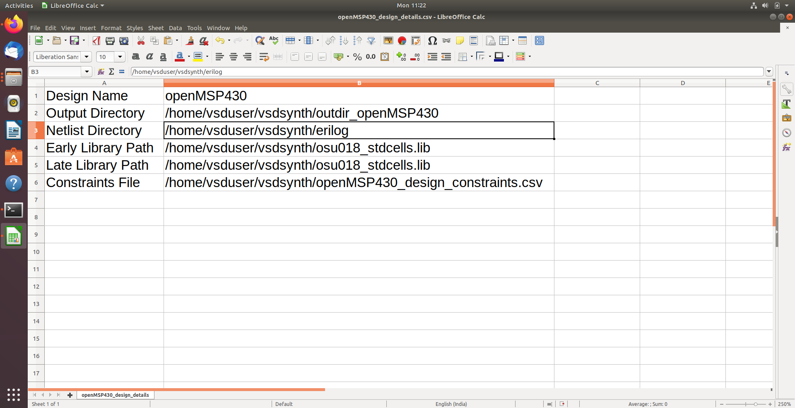
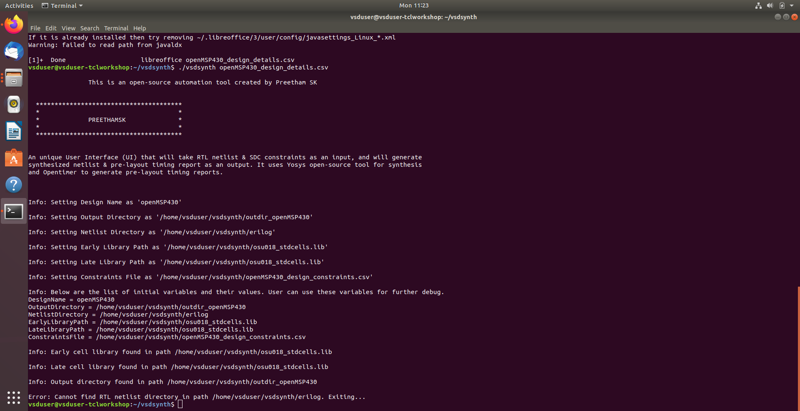
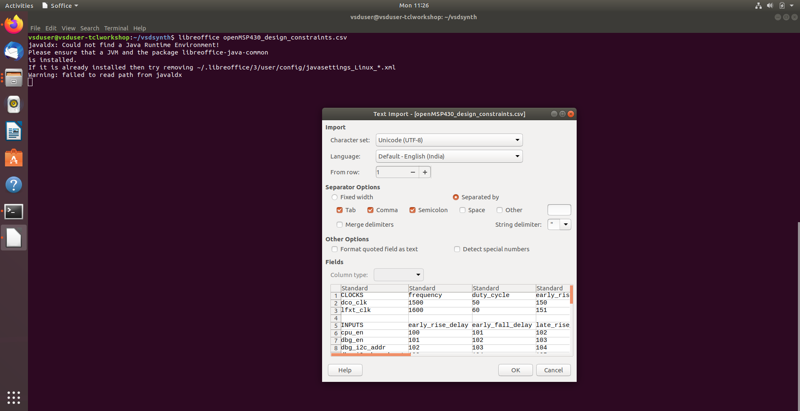
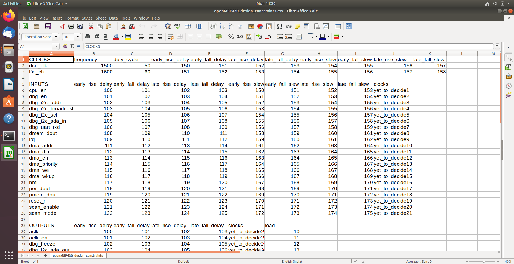
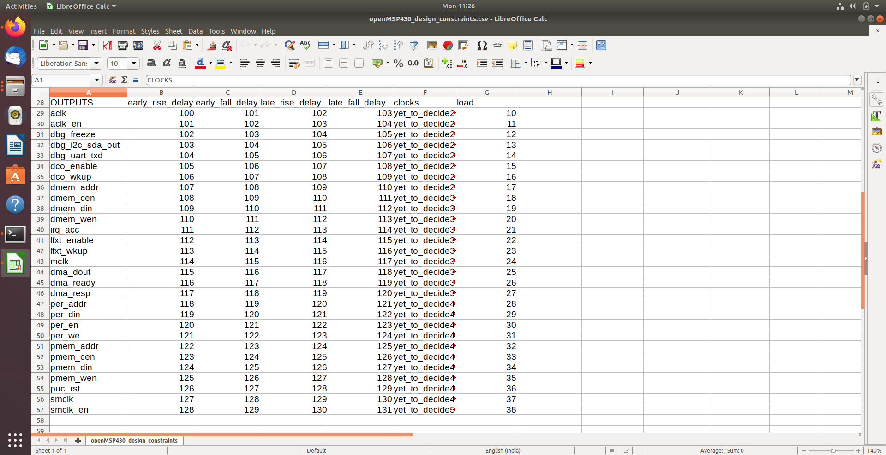

## Task 3: Matrix Row Computation & Data Indexing

- Implemented **programmatic dimensioning** using TCL matrix commands to calculate total row count of loaded CSV data for reliable processing boundaries.
- Developed **array-matrix linking** to connect structural matrices with internal TCL arrays, enabling rapid data access and manipulation.
- Added **boundary condition management** to iterate through all rows while ignoring empty termination rows.
- Configured **header-to-data differentiation** for accurate mapping of metadata headers to design constraint values.
- Verified **flow synchronization** to ensure row computation logic scales with variable-length CSV inputs, supporting small to large SOC designs.

**Screenshot:**
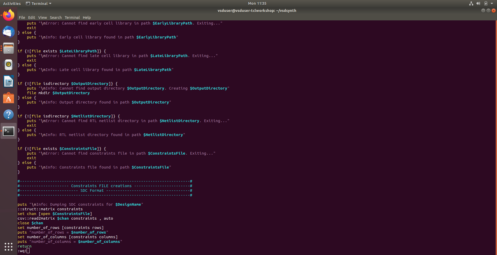
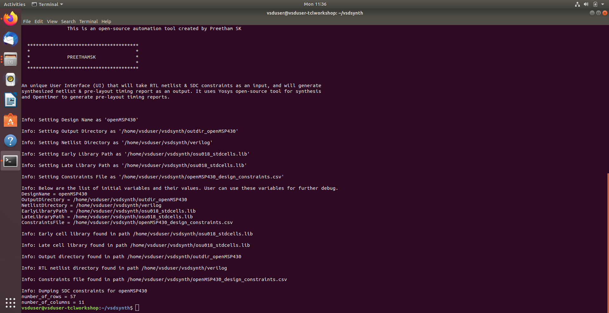
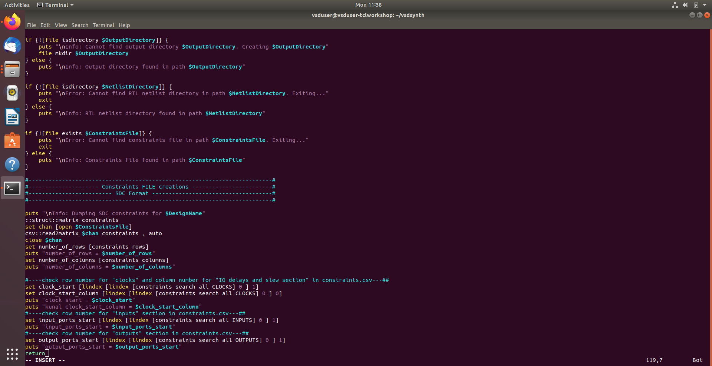
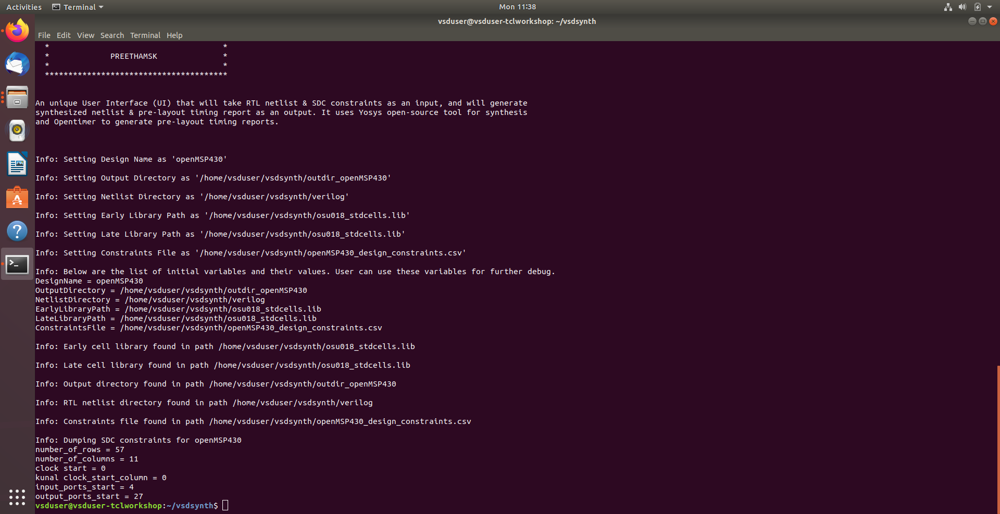
