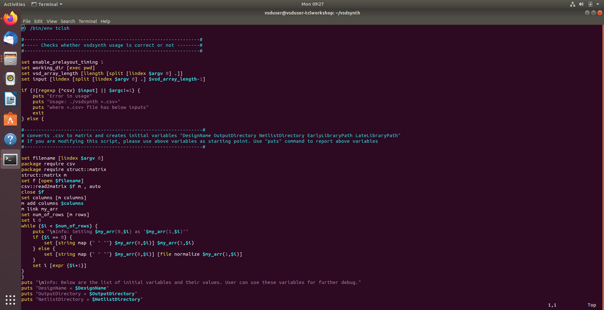
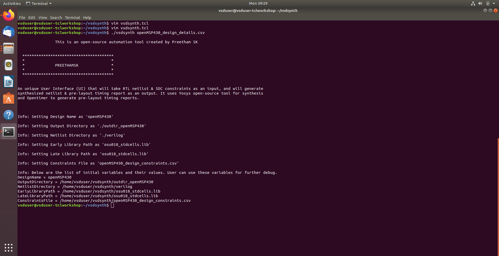
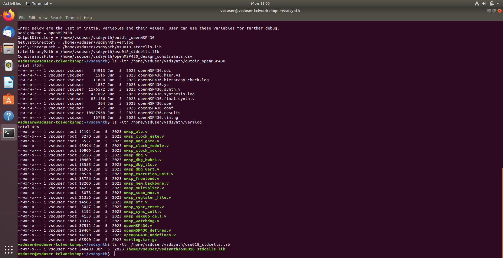
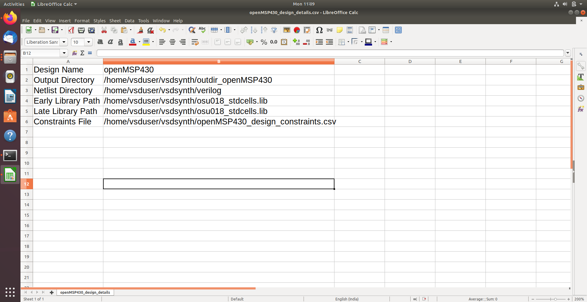

# Day 2 : Variable Creation and Processing Constraints from CSV

## Task 1: Variable Creation & CSV Data Processing

- Developed a **TCL-based CSV parsing engine** to automate variable assignment for design automation.
- Leveraged `struct::matrix` and `csv` packages to parse multi-column design data into a searchable internal format.
- Created an **automated loop** to read CSV keywords and assign them as global TCL variables for dynamic tool configuration.
- Implemented **absolute path mapping** using `file normalize` to prevent file access errors during synthesis.
- Built a **runtime debug dashboard** to display all initialized design variables for immediate verification.
- Validated the engine with the `openMSP430` design, ensuring RTL netlists and `.lib` timing models were correctly mapped.

**Screenshot:**

