# Day 3 Processing Clock and Input Constraints

## Task 1: Automated Clock Constraint Generation

- Developed a **translation engine** to convert CSV data into functional SDC commands for automated clock definition.
- Implemented **clock data parsing** to extract Clock Name and Period metadata from the internal design matrix.
- Created **standardized SDC syntax routines** to generate `create_clock` commands compatible with industry-standard EDA tools.
- Configured **automated file generation** to create and populate the `.sdc` constraint file in the design output hierarchy.
- Integrated **precision timing control** to handle period and duty cycle calculations for accurate synthesis timing targets.
- Verified the **accuracy of generated clock constraints** by inspecting the output SDC file against the CSV configuration.

**Screenshot:**
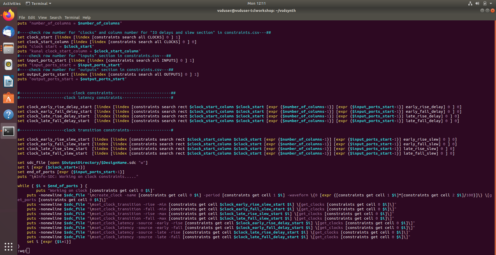
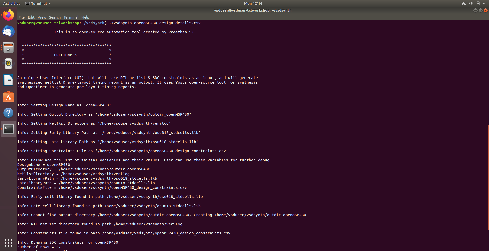
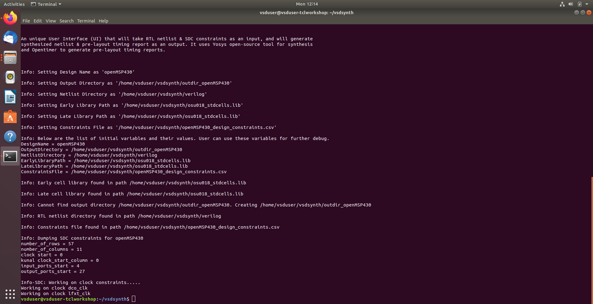
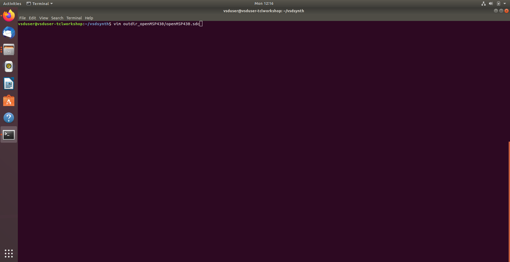
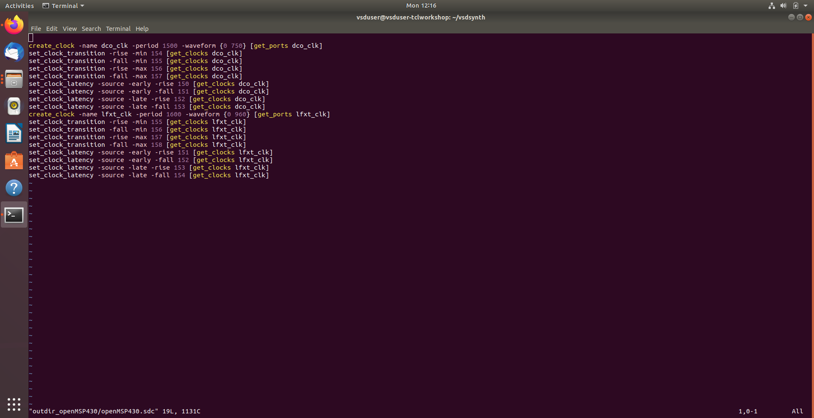
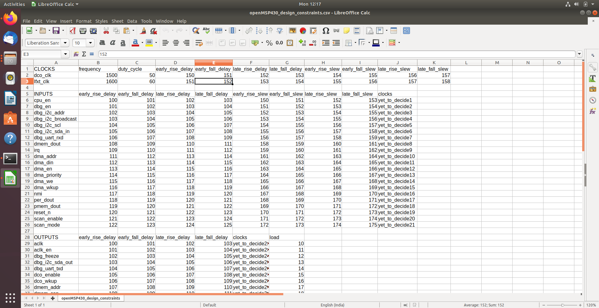

## Task 2: Port Categorization & Bus Expansion Logic

- Developed a **smart port parser** to distinguish between single-bit signals and multi-bit buses for full timing coverage.
- Implemented **pattern-based identification** using TCL regular expressions to detect bus indices automatically.
- Created a **categorization engine** to separate ports into "Bussed" and "Bit" types for specialized handling.
- Added **namespace sanitization** to format CSV-derived port names for proper synthesis netlist integration.
- Prepared data structures to **expand bus references** (e.g., `DATA[7:0]`) into individual SDC constraints.
- Validated the algorithm with the `openMSP430` netlist, confirming correct identification and sorting of primary inputs.

**Screenshot:**
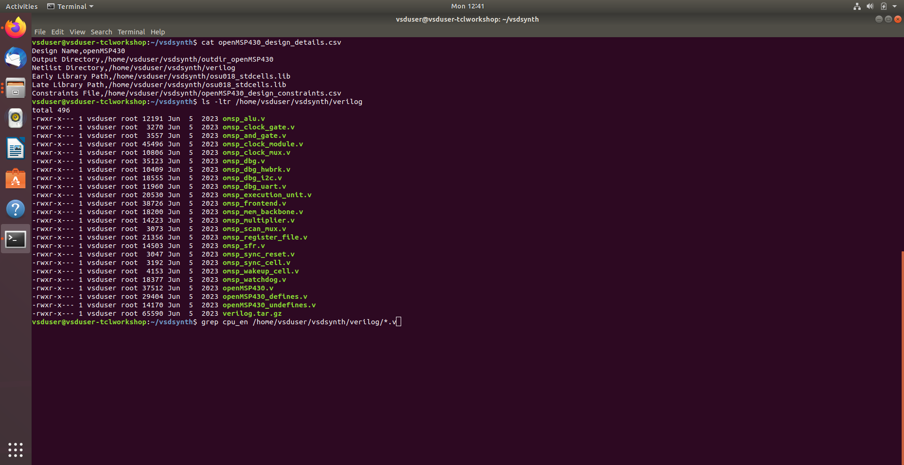
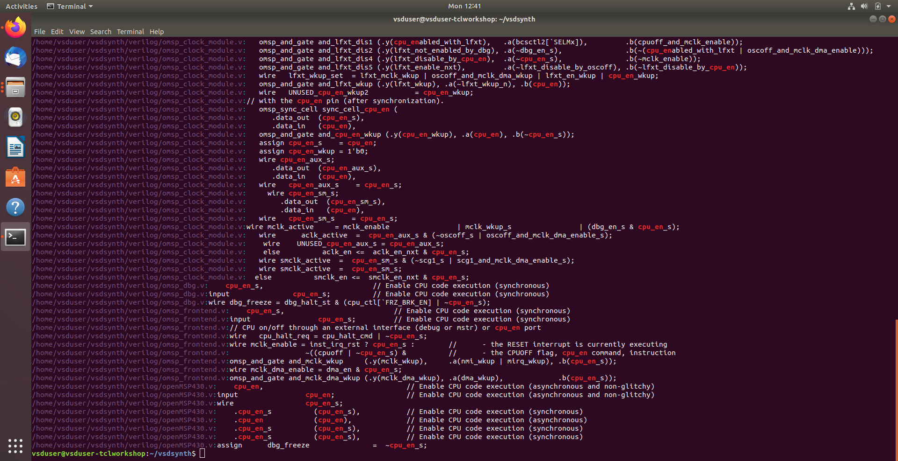

## Task 3: Automated Port Extraction & Space-Normalization

- Integrated **dynamic RTL scanning** to automatically extract all input port declarations from Verilog source files.
- Developed **fixed-space reformatting routines** to standardize whitespaces and tabs for consistent parsing.
- Implemented **automated data cleaning** to strip Verilog keywords and delimiters, isolating pure signal names for constraint mapping.
- Utilized **temporary file buffering** for efficient data handling, ensuring performance with high-gate-count netlists.
- Cross-validated the extraction engine against the `openMSP430` design to ensure accurate identification and formatting of all primary inputs.

**Screenshot:**
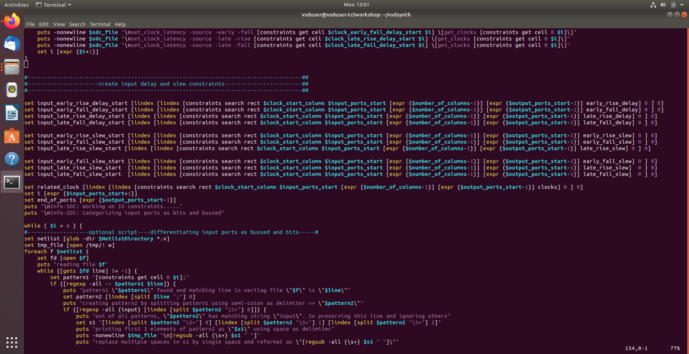
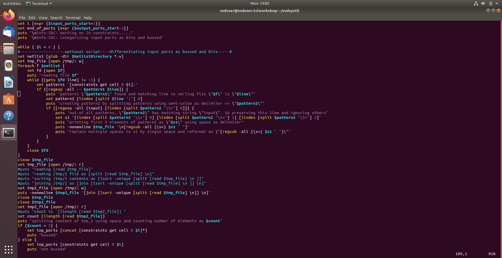

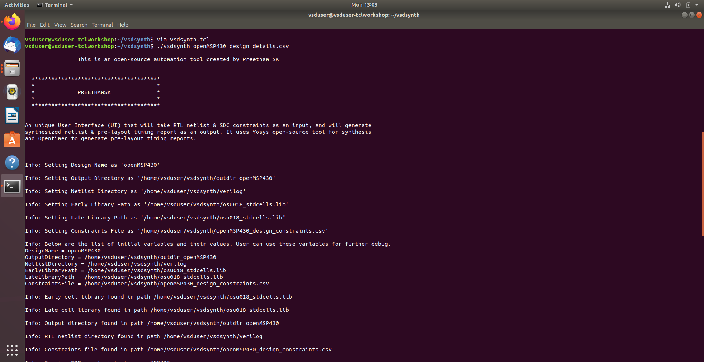
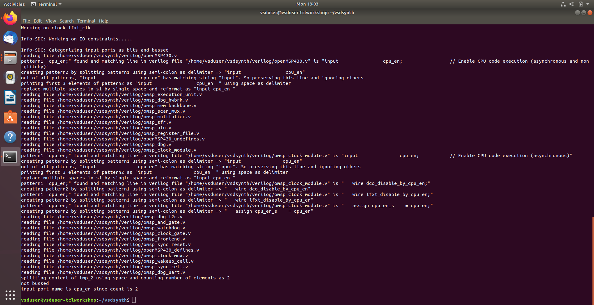
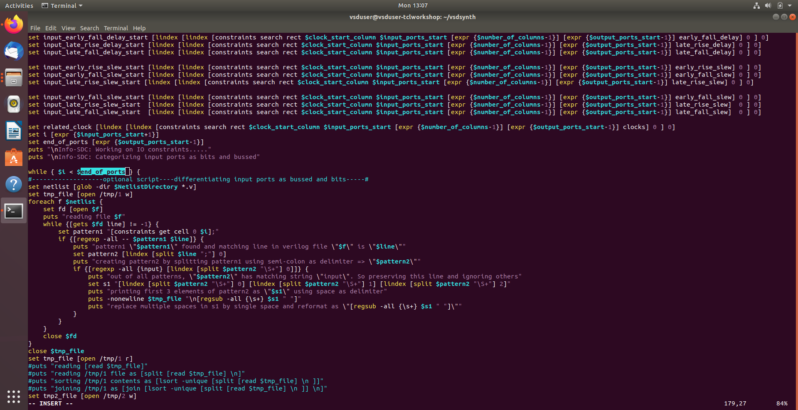
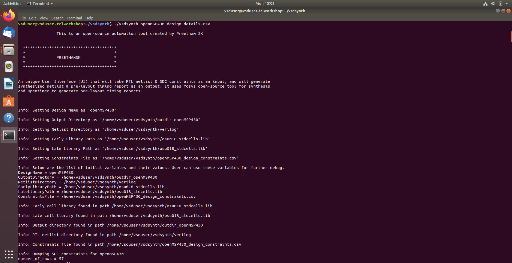
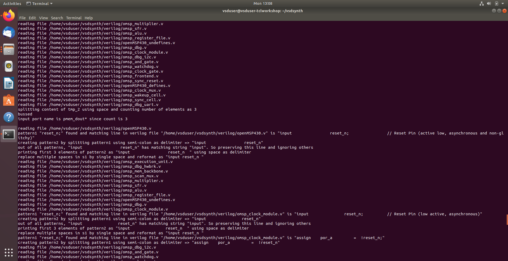
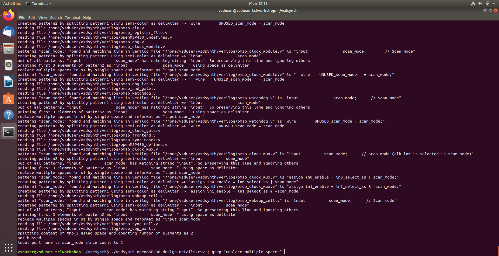
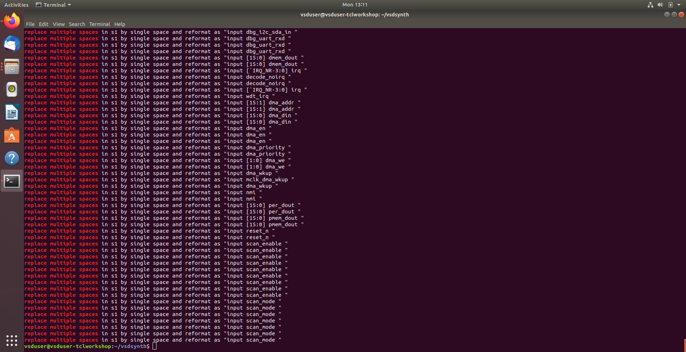
