# Day 3 Processing Clock and Input Constraints

## Summary

- Developed a **CSV-to-SDC translation engine** to automate clock and input constraint generation for synthesis.
- Implemented **automated clock creation**, parsing Clock Name and Period from CSV, generating `create_clock` commands, and ensuring precise timing targets.
- Engineered a **smart port parser** to categorize signals into single-bit and bussed types, enabling full coverage for timing constraints.
- Integrated **dynamic RTL scanning and space-normalization**, extracting port names from Verilog and standardizing formatting for parsing accuracy.
- Applied **dual-layer pattern matching** and advanced differentiation logic to map CSV-defined constraints to both bit-level and bus-level signals.
- Automated **SDC command generation** for `set_input_delay`, `set_input_transition`, and `set_output_delay`, appending all constraints to a single master SDC file.
- Ensured **hardware-software synchronization** using `[get_ports]` syntax, guaranteeing compatibility with Yosys and Opentimer.
- Validated **flow scalability and accuracy** on the `openMSP430` design, confirming that all primary inputs and clocks were constrained correctly without manual intervention.

## Task 1: Automated Clock Constraint Generation

- Developed a **translation engine** to convert CSV data into functional SDC commands for automated clock definition.
- Implemented **clock data parsing** to extract Clock Name and Period metadata from the internal design matrix.
- Created **standardized SDC syntax routines** to generate `create_clock` commands compatible with industry-standard EDA tools.
- Configured **automated file generation** to create and populate the `.sdc` constraint file in the design output hierarchy.
- Integrated **precision timing control** to handle period and duty cycle calculations for accurate synthesis timing targets.
- Verified the **accuracy of generated clock constraints** by inspecting the output SDC file against the CSV configuration.

**Screenshot:**

## Task 2: Port Categorization & Bus Expansion Logic

- Developed a **smart port parser** to distinguish between single-bit signals and multi-bit buses for full timing coverage.
- Implemented **pattern-based identification** using TCL regular expressions to detect bus indices automatically.
- Created a **categorization engine** to separate ports into "Bussed" and "Bit" types for specialized handling.
- Added **namespace sanitization** to format CSV-derived port names for proper synthesis netlist integration.
- Prepared data structures to **expand bus references** (e.g., `DATA[7:0]`) into individual SDC constraints.
- Validated the algorithm with the `openMSP430` netlist, confirming correct identification and sorting of primary inputs.

**Screenshot:**

## Task 3: Automated Port Extraction & Space-Normalization

- Integrated **dynamic RTL scanning** to automatically extract all input port declarations from Verilog source files.
- Developed **fixed-space reformatting routines** to standardize whitespaces and tabs for consistent parsing.
- Implemented **automated data cleaning** to strip Verilog keywords and delimiters, isolating pure signal names for constraint mapping.
- Utilized **temporary file buffering** for efficient data handling, ensuring performance with high-gate-count netlists.
- Cross-validated the extraction engine against the `openMSP430` design to ensure accurate identification and formatting of all primary inputs.

**Screenshot:**

## Task 4: Bit and Bussed Port Differentiation Logic

- Implemented **dual-layer pattern matching** to verify CSV-defined constraints against the reformatted RTL port list.
- Developed **automated SDC formatting routines** for `set_input_delay`, `set_input_transition`, and `set_output_delay` commands.
- Engineered **intelligent bus handling** to apply constraints accurately to entire buses or individual bits as required.
- Configured **streamlined file I/O** to append all interface constraints directly to the master SDC file for a single source of truth.
- Ensured **synthesis compatibility** by using standard `[get_ports]` syntax, making constraints immediately usable by Yosys or other EDA tools.

**Screenshot:**
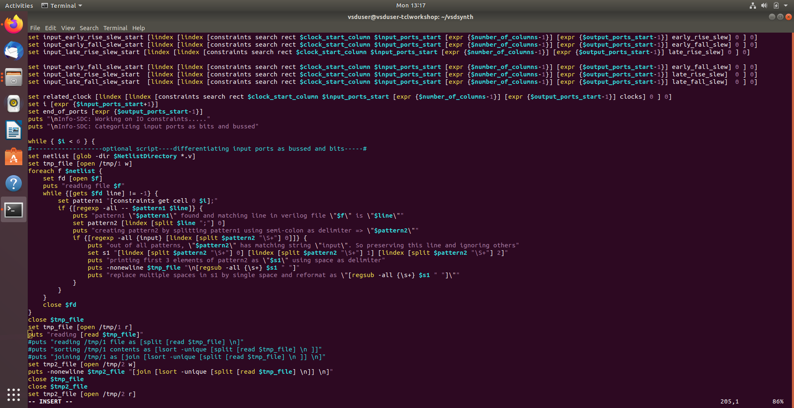
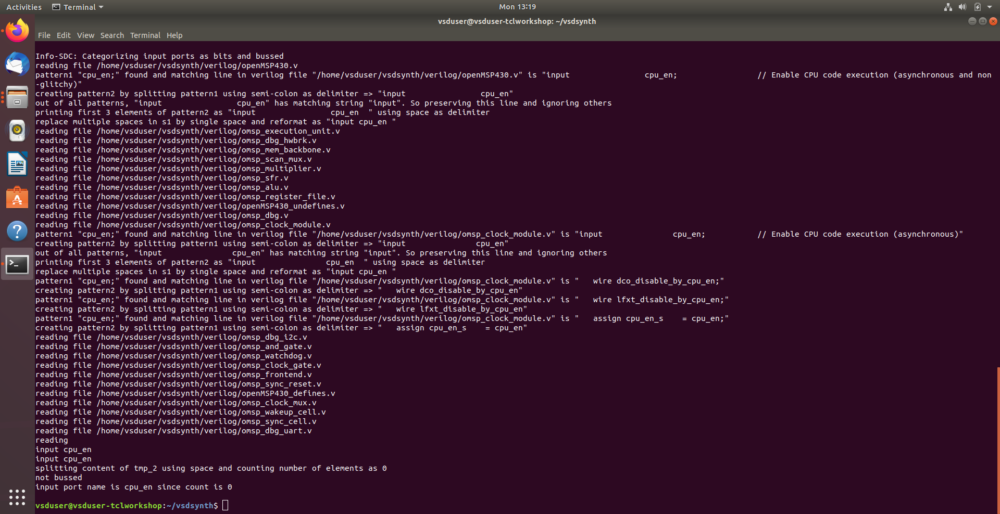
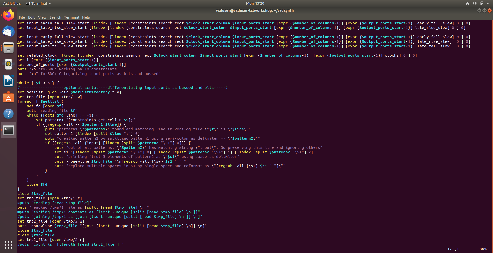
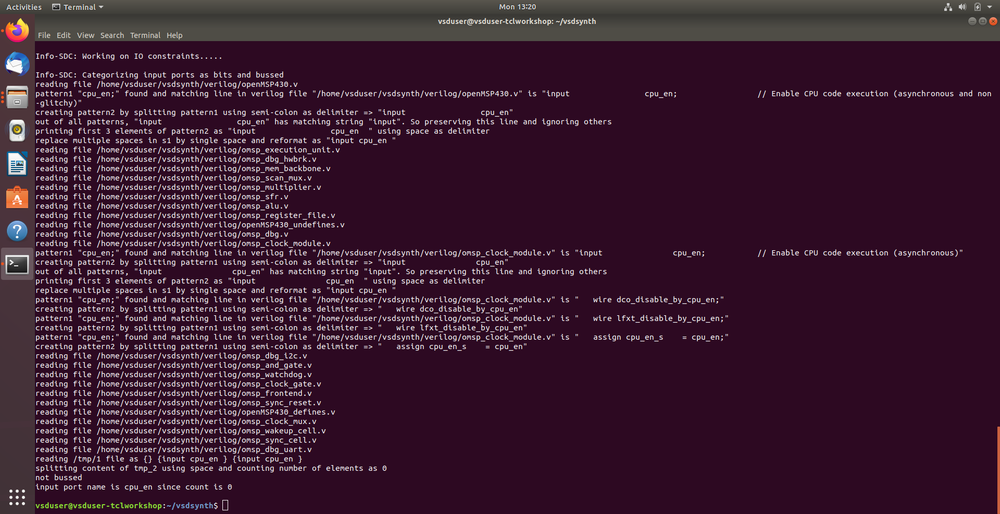

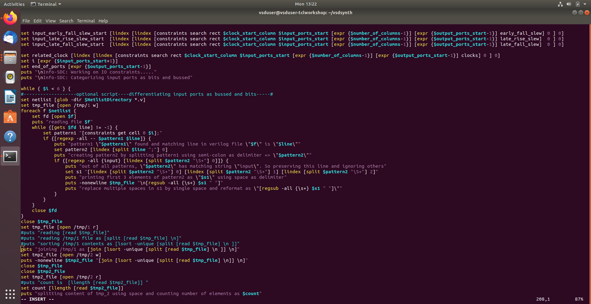
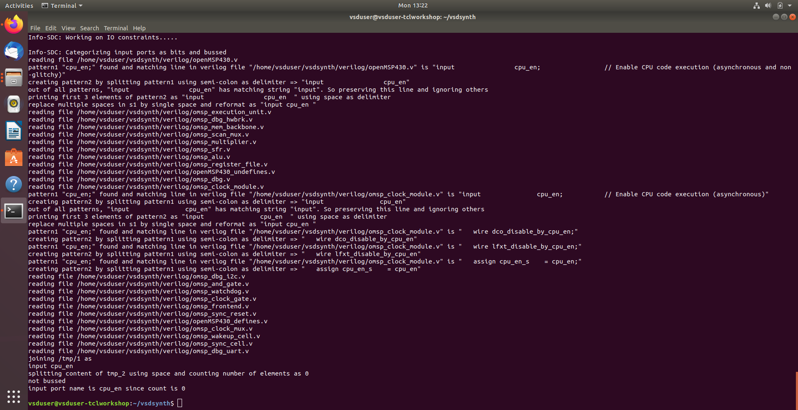
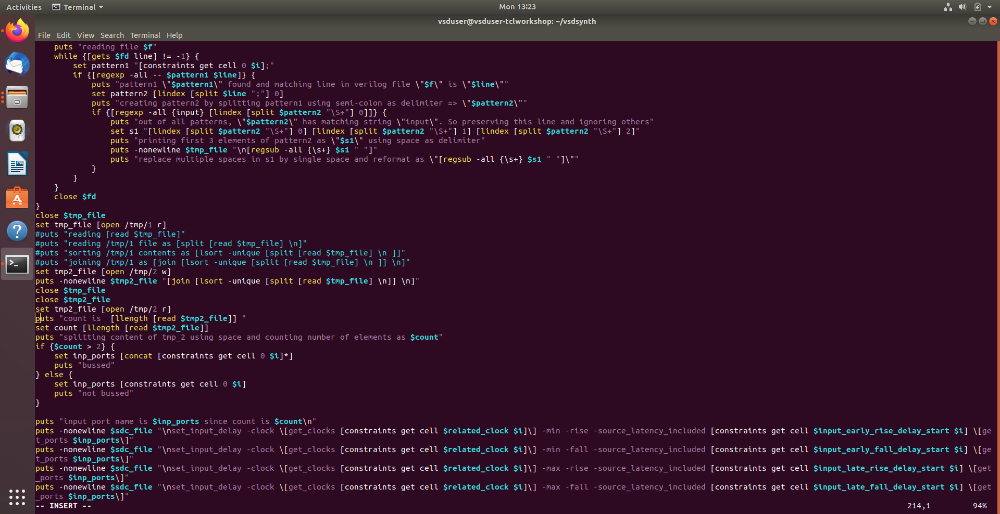
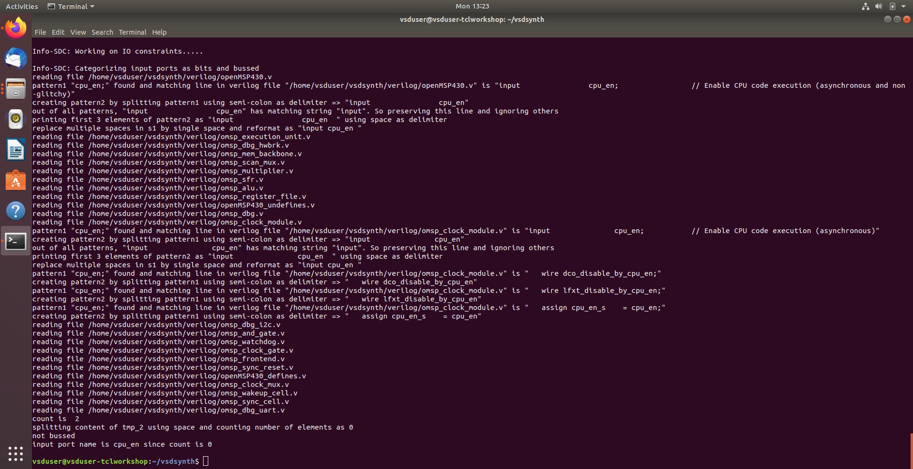
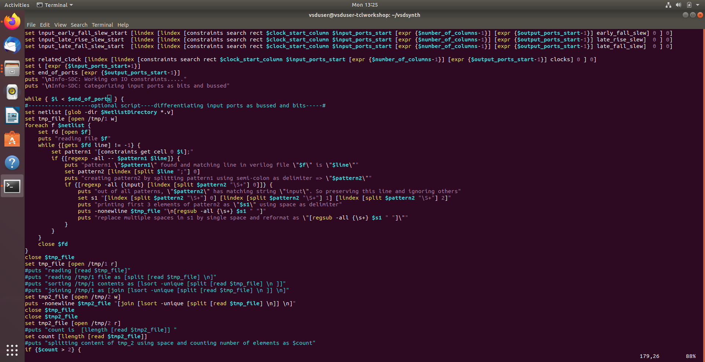
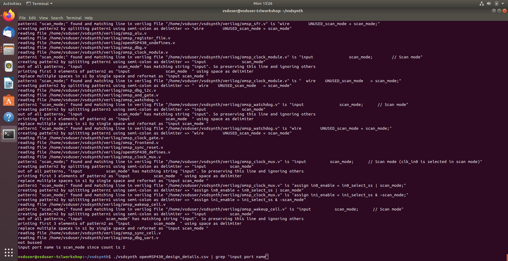
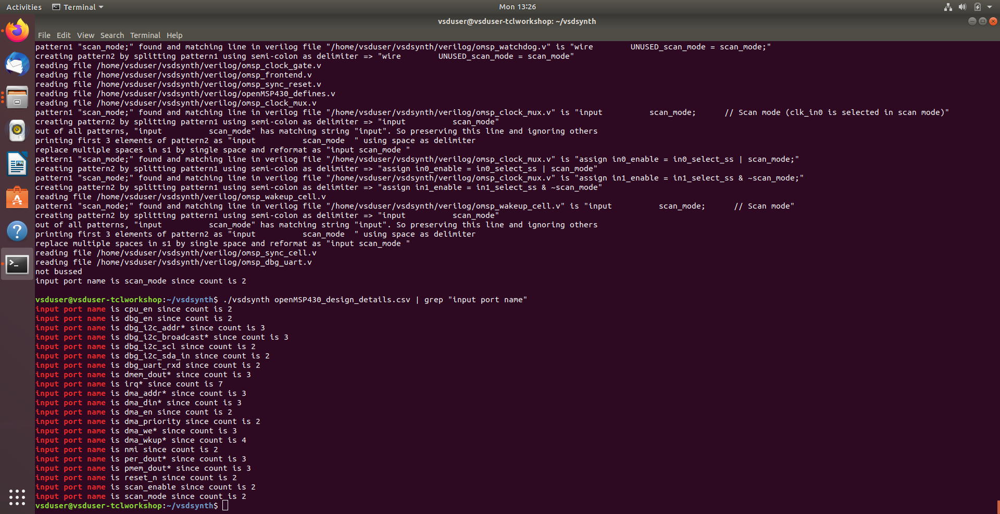

## Task 5: Input Constraint Generation & Advanced Port Differentiation

- Developed **algorithmic port matching** to link high-level constraints with RTL port declarations.
- Implemented **intelligent bus detection** to identify bussed signals and apply constraints to individual bits accurately.
- Engineered **automated SDC command writing** for `set_input_delay` and `set_input_transition`, dynamically appending to the SDC file.
- Ensured **hardware-software synchronization** using `get_ports` syntax for compatibility with Yosys and Opentimer.
- Validated the **flow scalability** on the `openMSP430` design, confirming accurate constraints for all primary inputs without manual intervention.

**Screenshot:**
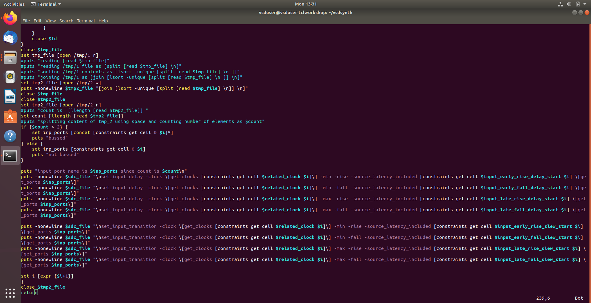
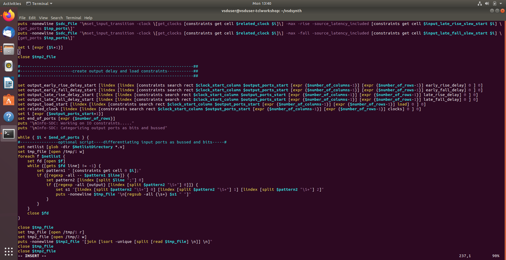
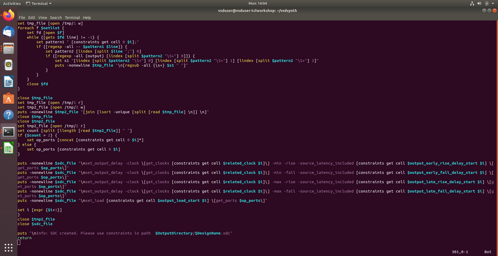
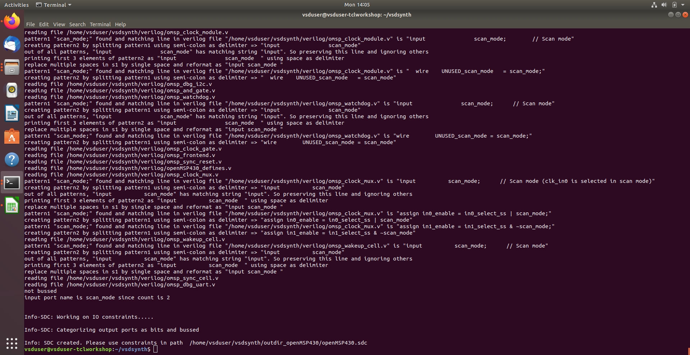
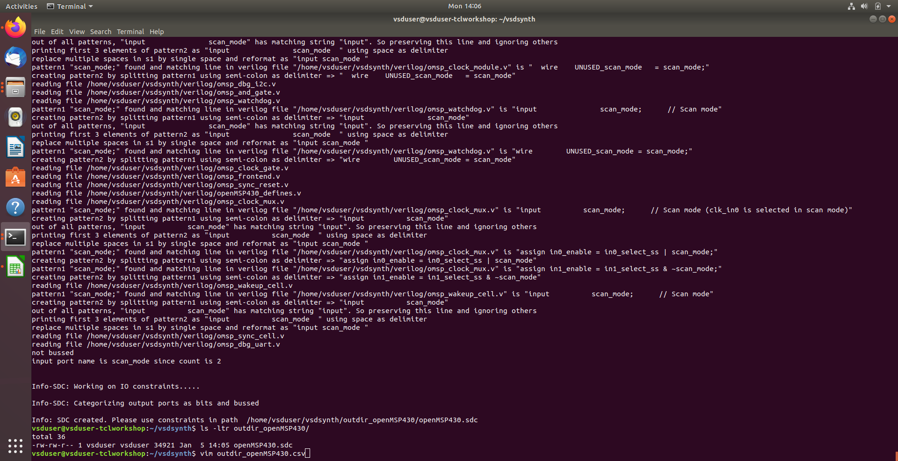
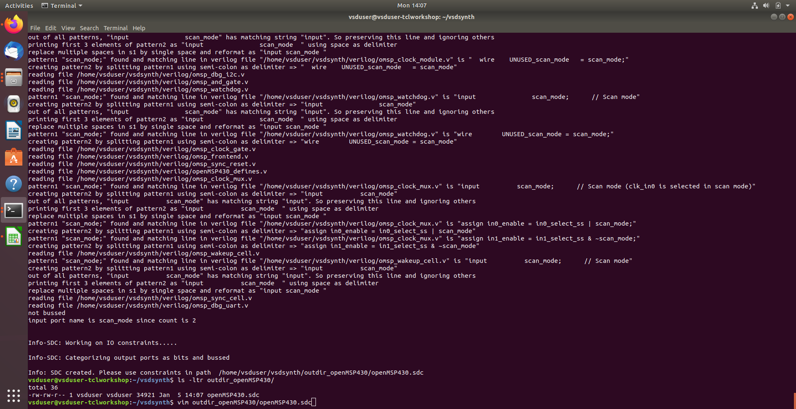
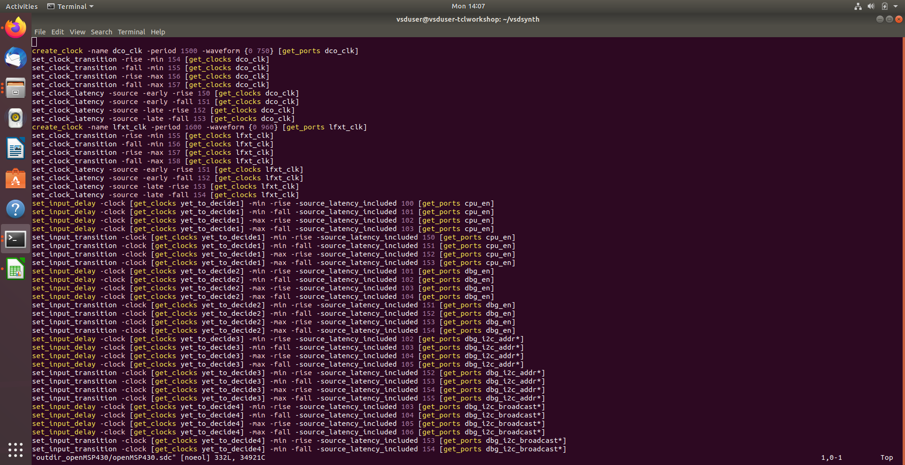

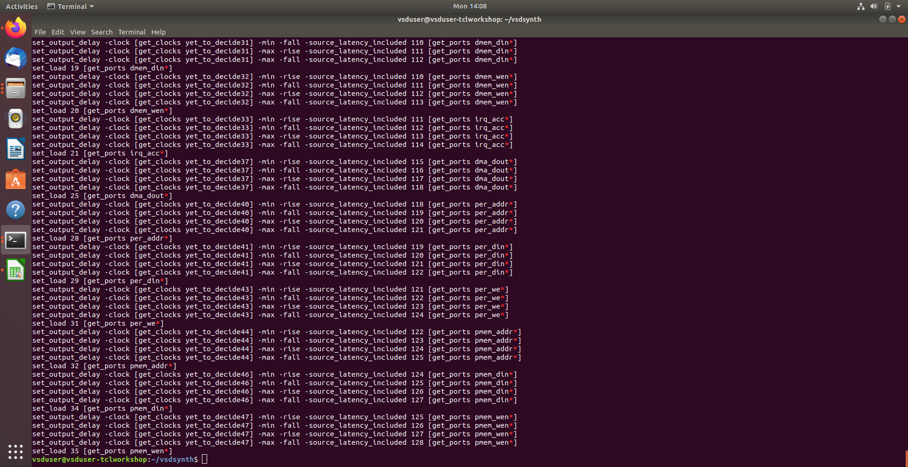
