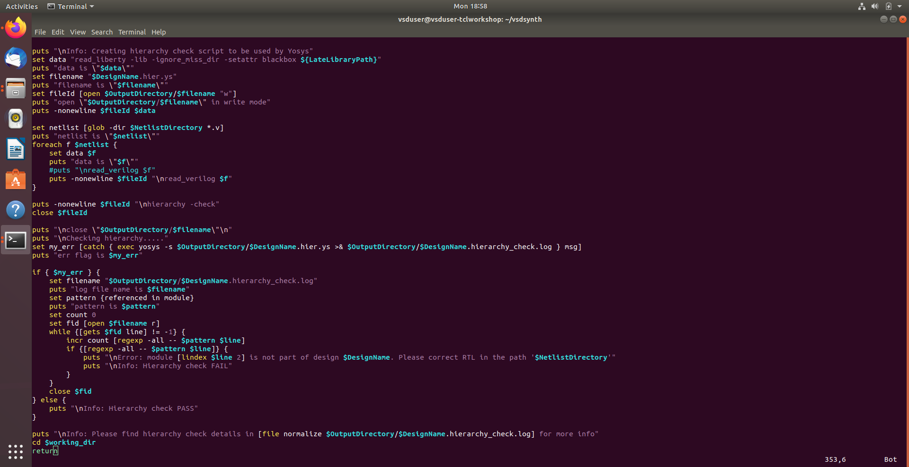
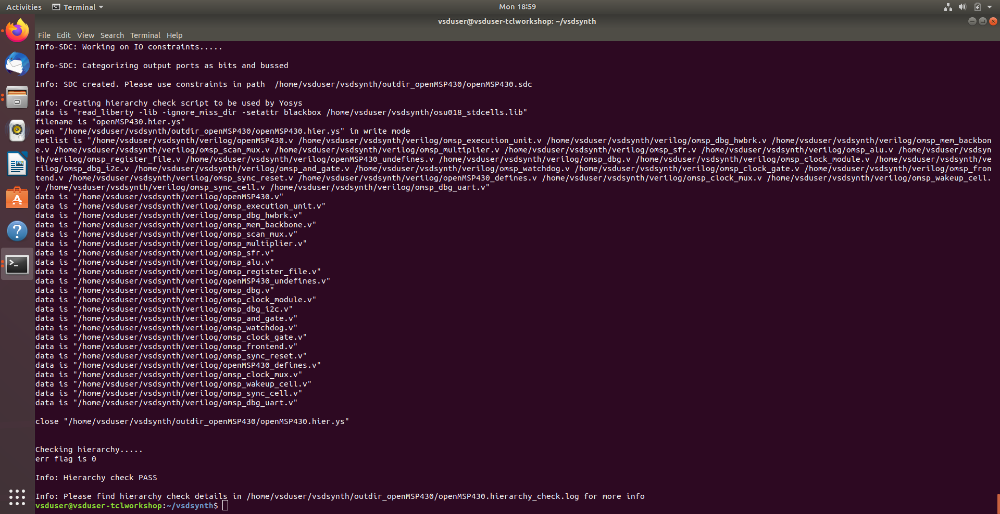
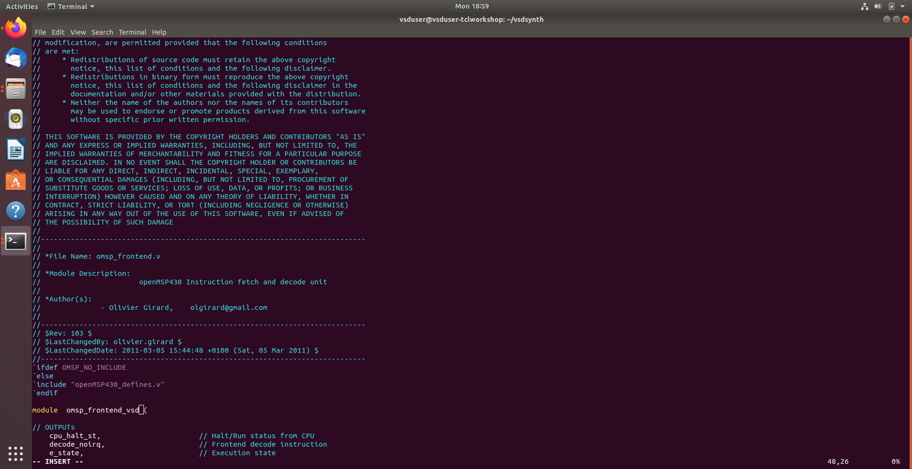
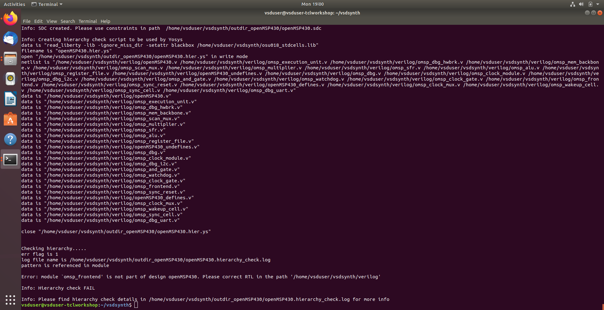

# Day 4 Complete Scripting and Yosys Synthesis Introduction

## Summary

- **Automated Synthesis Script Generation:** Developed `yosys_run.tcl` dynamically, allowing seamless RTL-to-synthesis transition with absolute paths for libraries and Verilog sources.  
- **Hierarchy Validation:** Integrated automated checks to ensure module consistency and design integrity before logic synthesis.  
- **Proactive Error Handling:** Implemented log monitoring and heuristic scanning to detect RTL structural issues, syntax errors, or unmapped logic in real time.  
- **Flow Protection & Graceful Termination:** Engineered fail-safe routines to halt the automation pipeline on errors, preventing invalid netlist generation and preserving output integrity.  
- **Variable-Driven Automation:** Leveraged design-specific variables (`$DesignName`, `$NetlistDirectory`) for synchronized, scalable execution across different projects.  
- **Enhanced CLI Feedback:** Provided clear, professional logging and actionable debugging messages to aid rapid troubleshooting.  
- **End-to-End Reliability:** Ensured that only structurally sound RTL and fully validated inputs enter Yosys synthesis, maintaining high automation reliability and reproducibility.

## Task 1: Hierarchy Check & Synthesis Script Generation

- Developed **dynamic Yosys script generation** to automate RTL-to-synthesis transition (`yosys_run.tcl`).
- Implemented **automated resource loading** of standard cell libraries and all Verilog sources using absolute paths.
- Integrated **structural hierarchy validation** to verify module consistency and design integrity before synthesis.
- Leveraged **variable-driven synthesis** using `$DesignName` and `$NetlistDirectory` for synchronized script execution.
- Provided **professional CLI feedback**, including status logging and headers for clear user experience.

**Screenshot:**

## Task 2: Error Handling Logic in Hierarchy Check

- Implemented **automated log monitoring** to capture Yosys hierarchy reports for real-time scanning.
- Developed **proactive error detection** to identify critical RTL issues, including module re-definitions and missing sub-modules.
- Engineered **graceful script termination** to halt execution upon detecting hierarchy errors, providing clear user feedback.
- Leveraged TCL's **`catch` and `grep` functions** to ensure all hierarchy-related warnings and errors are flagged.
- Maintained **flow integrity** by preventing invalid netlist generation until all structural RTL issues are resolved.

**Screenshot:**

## Task 3: Integrated Synthesis Error Handling Script

- Implemented **system traps** using TCL `catch` to monitor Yosys calls and prevent tool-wide crashes.
- Developed **heuristic log scanning** to detect common synthesis errors, such as syntax issues or unmapped logic.
- Added **proactive input validation** to ensure all required files (CSV, Verilog, Lib) are present before execution.
- Engineered **graceful flow termination** to halt the automation pipeline while preserving output integrity upon error detection.
- Enhanced **actionable debugging feedback** via CLI, providing specific error codes and messages for faster troubleshooting.

**Screenshot:**

