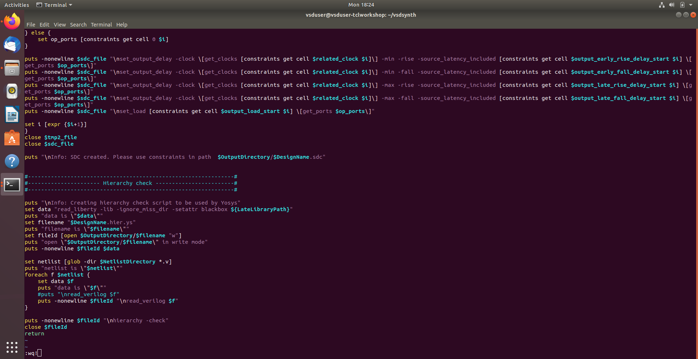
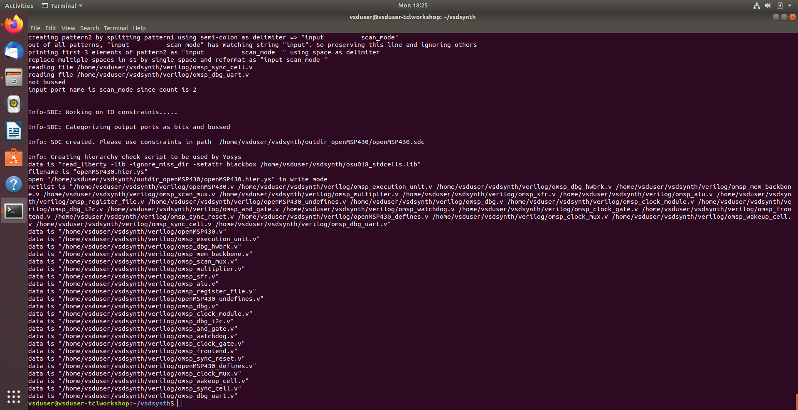
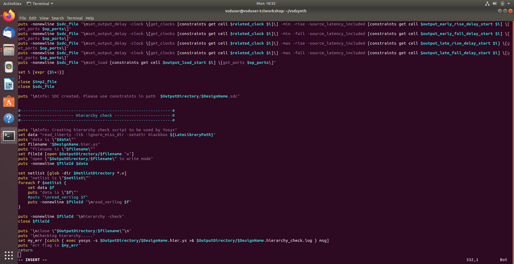
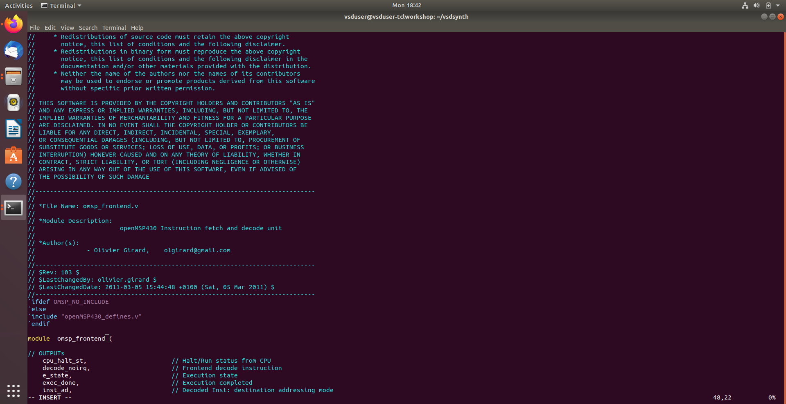
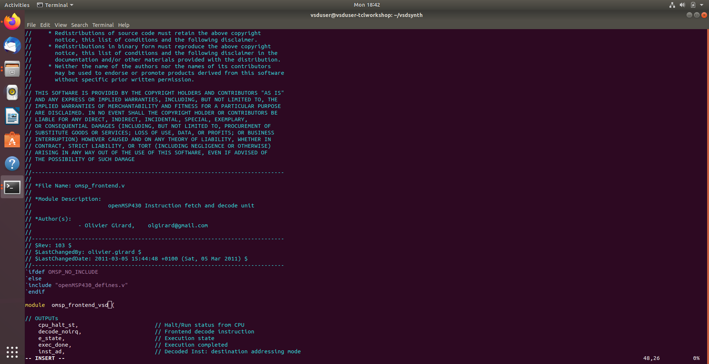
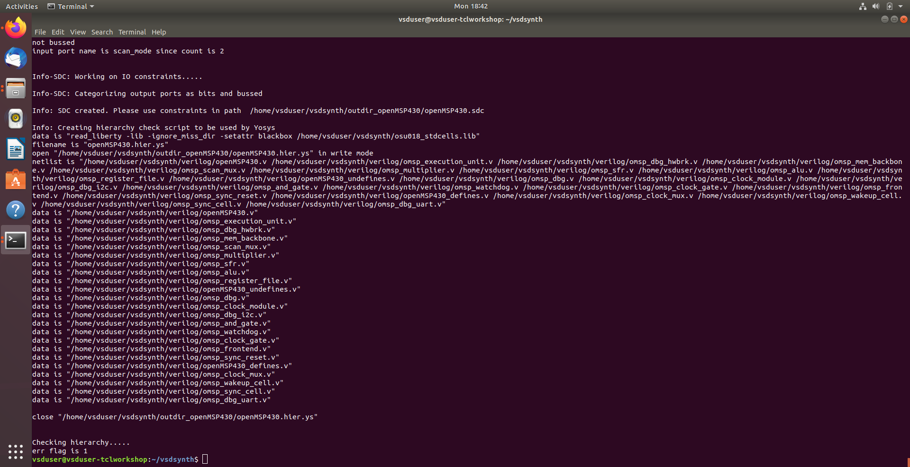
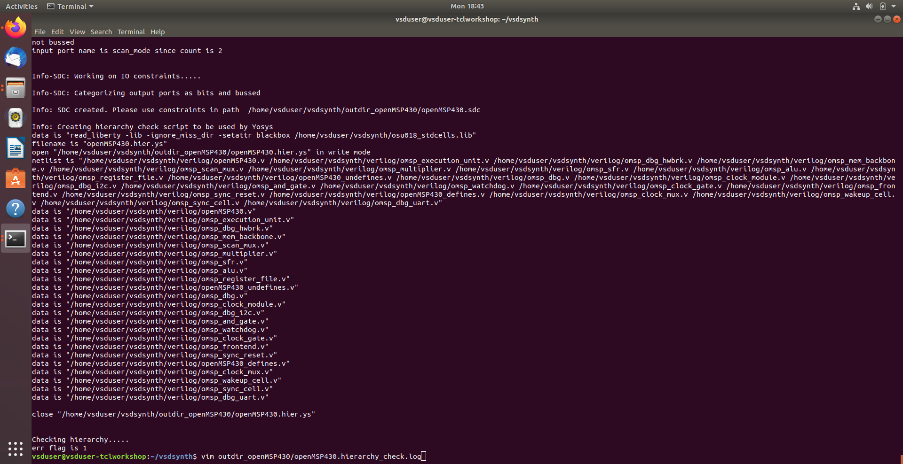

# Day 4 Complete Scripting and Yosys Synthesis Introduction

## Task 1: Hierarchy Check & Synthesis Script Generation

- Developed **dynamic Yosys script generation** to automate RTL-to-synthesis transition (`yosys_run.tcl`).
- Implemented **automated resource loading** of standard cell libraries and all Verilog sources using absolute paths.
- Integrated **structural hierarchy validation** to verify module consistency and design integrity before synthesis.
- Leveraged **variable-driven synthesis** using `$DesignName` and `$NetlistDirectory` for synchronized script execution.
- Provided **professional CLI feedback**, including status logging and headers for clear user experience.

**Screenshot:**

## Task 2: Error Handling Logic in Hierarchy Check

- Implemented **automated log monitoring** to capture Yosys hierarchy reports for real-time scanning.
- Developed **proactive error detection** to identify critical RTL issues, including module re-definitions and missing sub-modules.
- Engineered **graceful script termination** to halt execution upon detecting hierarchy errors, providing clear user feedback.
- Leveraged TCL's **`catch` and `grep` functions** to ensure all hierarchy-related warnings and errors are flagged.
- Maintained **flow integrity** by preventing invalid netlist generation until all structural RTL issues are resolved.

**Screenshot:**

